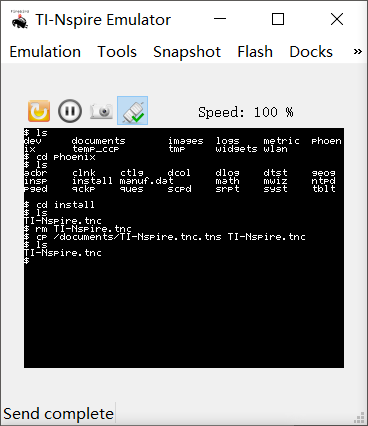

# nSimpleShell
Ndless 上的一个命令行文件管理器



## Commands
已实现命令:    
```shell
cat <file> 查看一个文件的内容
cd [path] 更变工作目录
cp <src-path> <dst-path> 复制一个文件
echo <some-text> 回显
ls [dir-name] 列出目录中的文件
pwd 查看当前工作目录
rm <file-name> 删除一个文件
exit 退出shell
```

已实现的语句: 
```shell
KEY=VALUE 赋值语句 
```

其他：
```shell
开启时自动执行脚本 /documents/.initrc.tns
```

## Download
https://github.com/haruue/nSimpleShell/releases

## Build
需要 Ndless 4.0 SDK
```shell
# clone this repo
git clone git@github.com:haruue/nSimpleShell.git

# build all
make

# rebuild or if you modified some files in /lib
make clean && make
```

## Install
Build 之后将 /build 下面的所有东西移动到 Nspire 的文档根目录。然后打开 shell 即可使用。

## How does it work
由于需要在同一个`nio_console`里输出结果，因此所有 module 都需要共用一个`nio_console`。另外，环境变量也没能直接实现。因此占用程序的两个参数，`argv[1]`用于存储当前的`nio_console`指针，`argv[2]`用于存储当前的环境变量指针。我们把这些子程序放到一个专门的目录里，供父程序调用，同时模块化可以很容易地增加功能。

此外，由于这种设计还是 too simple ，所以与我们平时使用的 shell 有很大的不同：

+ 环境变量都是全局的。子程序可以直接修改和获取父程序的环境变量。
+ 直接使用环境变量来代表一些 shell 信息，比如直接用`PWD`来表示当前工作目录，修改`PWD`也会修改当前工作目录。
+ `PATH`暂时只支持设置单目录

## Develop
+ 创建一个新的 module
    ```shell
    cd ./module
    make new NAME=<module name>
    ```
    这样会自动生成一个 module 的`Makefile`和`main.c`模板

+ `module_main()`函数：直接当作 module 的 main 函数使用即可，实际上的 main 函数在`module.h`里，我们使用它进行前置参数处理，设置`nio_console`和全局变量指针并将这两个参数从参数表里移除，这样你就可以像往常一样直接使用`argc`和`argv`。

+ 输出时请使用`nio_printf()`函数，如果要调用需要`nio_console`指针的函数，请传入`nio_get_default()`作为`nio_console`指针。

+ 使用和设置环境变量请直接使用`setenv`, `putenv`和`getenv`。

+ 涉及到相对路径的操作请使用`dir_common.h`，涉及到 module 与 shell 交互的操作请使用`sh_common.h`

## Troubleshooting
哪位菊苣移植一个`busybox`到 Ndless 来吧。。这样重新实现很多模块看起来并不现实。。也很难具有兼容性。。。

## License
```License
Copyright 2016 Haruue Icymoon

Licensed under the Apache License, Version 2.0 (the "License");
you may not use this file except in compliance with the License.
You may obtain a copy of the License at

    http://www.apache.org/licenses/LICENSE-2.0

Unless required by applicable law or agreed to in writing, software
distributed under the License is distributed on an "AS IS" BASIS,
WITHOUT WARRANTIES OR CONDITIONS OF ANY KIND, either express or implied.
See the License for the specific language governing permissions and
limitations under the License.
```